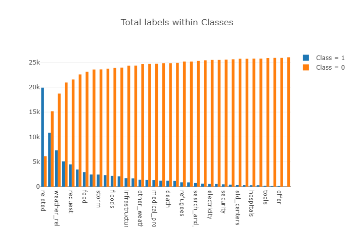
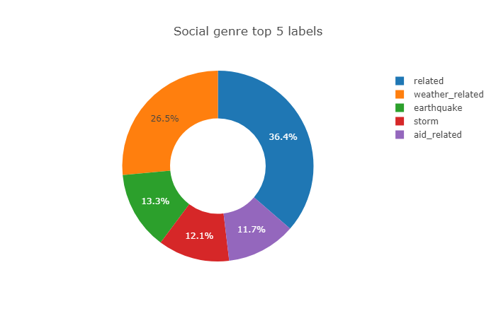
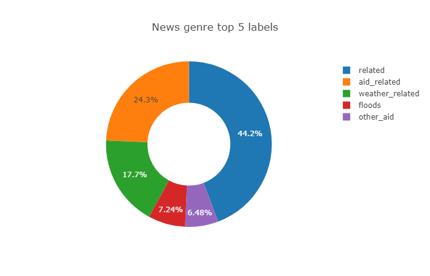
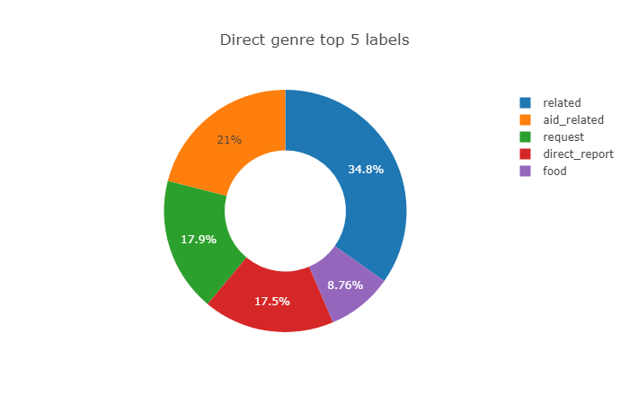

# Disaster Response Project
> 
The motivation behind this machine learning project is to build a web application that classifies text messages received in the event of a disaster such as during storms or earthquakes. The web application can be used by emergency workers to classify messages, and this could be essential for effective allocation of resources. The output of the ML model is a classification of the message into several categories such as water, shelter, food and clothing. Such a classification would give the app user a better awareness on what kind of help/aid is needed in case of emergency.

## Table of contents
* [Data and Code](#data-and-code)
* [Screenshots of the Flask web app](#screenshots-of-the-flask-web-app)
* [Prerequisites](#prerequisites)
* [Instructions on running the application](#instructions-on-running-the-application)

## Data and Code
* The ETL data pipeline code is contained in the data/process_data.py file. This pipeline reads the dataset, cleans the data, and then stores the cleaned data in a SQLite database. 
* The machine learning pipeline code is contained in the models/train_classifier.py file. The pipeline uses NLTK, scikit-learn's Pipeline and GridSearchCV to output a final trained model that uses the message column to predict classification for 36 categories. The trained model is exported to a pickle file to be used by the web app for predictions. 
* The code for the Flask web app is contained in the app folder and the main script for the application is the run.py file. 
* There are two jupyter notebook files (ETL Pipeline Preparation.ipynb and ML Pipeline Preparation.ipynb) which were used in the development of the ETL and ML pipeline.

## Screenshots of the Flask web app

## Prerequisites
* Pandas
* Numpy
* NLTK
* Flask
* Plotly
* Sklearn
* Sqlalchemy
* Pickle
* re
* os
* warnings
* Matplotlib
Jupyter notebook and python 3.6 are needed to run the notebooks and python scripts.

## Instructions on running the application
1. Run the following commands in the project's root directory to set up your database and model.
    - To run ETL pipeline that cleans data and stores in database
        `python data/process_data.py data/disaster_messages.csv data/disaster_categories.csv data/DisasterResponse.db`
    - To run ML pipeline that trains classifier and saves
        `python models/train_classifier.py data/DisasterResponse.db models/classifier.pkl`
2. Run the following command in the app's directory to run your web app.
    `python run.py`
3. Go to http://0.0.0.0:3001/

